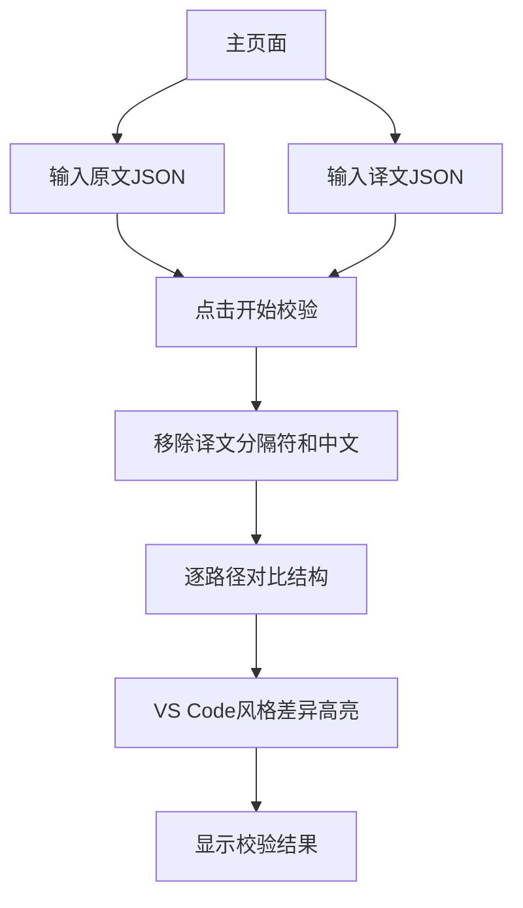

## 1. 产品概述

一个独立的网页JSON校验器工具，支持用户输入原文和译文JSON文件（支持粘贴文本或上传本地文件），自动对译文进行格式校验和路径对比，提供通过/错误/警告的校验结果。新增VS Code风格的文本差异高亮功能，支持并排和逐行视图模式，直观展示JSON结构和内容的差异。该工具可直接集成到现有前端项目中，无需新增依赖，完全在浏览器本地运行。

该工具主要解决开发者在处理多语言JSON文件时，需要快速验证译文格式是否正确、是否缺少或多余字段的问题，通过可视化的差异对比帮助用户快速定位问题，提高国际化开发效率。

## 2. 核心功能

### 2.1 用户角色
无需用户注册，所有功能对匿名用户开放使用。

### 2.2 功能模块

该网页校验器包含以下核心页面：

1. **主页面**：文件输入区域、差异对比视图、校验结果显示、操作按钮。

### 2.3 页面详情

| 页面名称 | 模块名称 | 功能描述 |
|----------|----------|----------|
| 主页面 | 文件输入区域 | 提供两个文本框分别输入原文和译文JSON，支持粘贴文本和上传本地文件功能 |
| 主页面 | 差异对比视图 | 提供VS Code风格的文本差异高亮，支持并排视图和逐行视图两种模式，背景色标注不同之处 |
| 主页面 | 校验结果显示 | 以颜色区分显示校验结果（绿色通过、红色错误、黄色警告），列出具体的错误信息和路径 |
| 主页面 | 操作按钮 | 包含"开始校验"和"清空"按钮，支持一键重新校验和重置界面 |

## 3. 核心流程

用户操作流程：
1. 用户在原文输入框粘贴或上传JSON文件
2. 用户在译文输入框粘贴或上传JSON文件  
3. 点击"开始校验"按钮
4. 系统自动移除译文中的分隔符和中文内容
5. 逐路径对比原文和译文结构
6. 在差异对比视图中高亮显示不同之处（使用VS Code风格背景色）
7. 显示校验结果（通过/错误/警告）

## 4. 用户界面设计

### 4.1 设计风格
- 主色调：简洁的白色背景配合蓝色操作按钮
- 字体：系统默认字体，14px正文，16px标题
- 布局：左右分栏布局，左侧输入区域，右侧差异对比和结果显示
- 按钮样式：圆角矩形按钮，hover效果
- 状态颜色：绿色(#28a745)通过，红色(#dc3545)错误，黄色(#ffc107)警告
- 差异高亮色：新增绿色(#d4edda)，删除红色(#f8d7da)，修改黄色(#fff3cd)

### 4.2 页面设计概览

| 页面名称 | 模块名称 | UI元素 |
|----------|----------|--------|
| 主页面 | 文件输入区域 | 两个并排的文本输入框，每个框上方有"原文JSON"和"译文JSON"标签，支持拖拽文件上传 |
| 主页面 | 差异对比视图 | 两个JSON编辑器并排显示，差异部分使用背景色高亮（新增绿色#d4edda，删除红色#f8d7da，修改黄色#fff3cd），支持切换逐行对比模式 |
| 主页面 | 校验结果显示 | 结果列表显示区域，使用不同颜色标识状态，显示具体的错误路径和描述信息 |
| 主页面 | 操作按钮 | 底部居中放置"开始校验"（蓝色）和"清空"（灰色）按钮 |

### 4.3 响应式设计
采用桌面优先设计，支持基本的响应式布局，在小屏幕设备上自动调整为垂直布局。