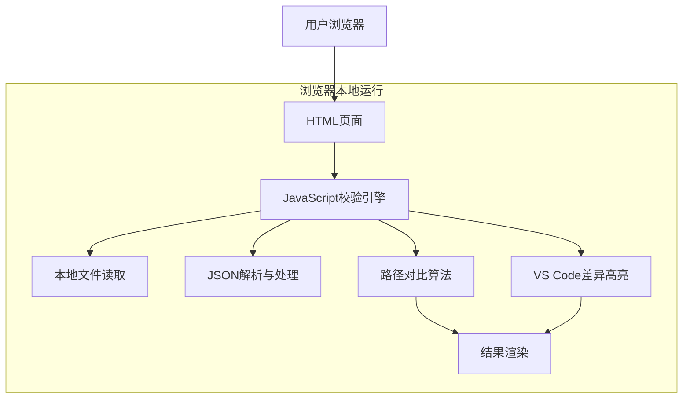

## 1. 架构设计



## 2. 技术描述

- 前端：原生HTML5 + CSS3 + JavaScript (ES6+)
- 初始化工具：无需构建工具，直接使用原生Web技术
- 后端：无
- 依赖：零依赖，纯原生实现
- 差异算法：基于LCS（最长公共子序列）的文本差异算法

## 3. 路由定义

该工具为单页面应用，只有一个主页面：

| 路由 | 用途 |
|-------|---------|
| / | 主页面，提供JSON校验功能 |

## 4. 核心功能实现

### 4.1 文件读取功能
```javascript
// 支持文件上传和粘贴文本两种方式
function handleFileUpload(file) {
    const reader = new FileReader();
    reader.onload = (e) => {
        return JSON.parse(e.target.result);
    };
    reader.readAsText(file);
}
```

### 4.2 JSON路径对比算法
```javascript
// 递归对比两个JSON对象的路径结构
function comparePaths(original, translated, path = '') {
    const errors = [];
    const warnings = [];
    
    // 移除译文中的分隔符和中文
    const cleanedTranslated = cleanTranslatedObject(translated);
    
    // 对比路径结构
    for (let key in original) {
        const currentPath = path ? `${path}.${key}` : key;
        
        if (!(key in cleanedTranslated)) {
            errors.push({
                path: currentPath,
                type: 'missing',
                message: `缺少字段: ${currentPath}`
            });
        } else if (typeof original[key] === 'object' && original[key] !== null) {
            const childResults = comparePaths(original[key], cleanedTranslated[key], currentPath);
            errors.push(...childResults.errors);
            warnings.push(...childResults.warnings);
        }
    }
    
    // 检查多余字段
    for (let key in cleanedTranslated) {
        if (!(key in original)) {
            warnings.push({
                path: path ? `${path}.${key}` : key,
                type: 'extra',
                message: `多余字段: ${path ? `${path}.${key}` : key}`
            });
        }
    }
    
    return { errors, warnings };
}
```

### 4.3 差异高亮算法
```javascript
// VS Code风格的差异高亮实现
function highlightDifferences(originalText, translatedText) {
    const originalLines = originalText.split('\n');
    const translatedLines = translatedText.split('\n');
    
    // 使用LCS算法找出差异
    const diff = computeLCS(originalLines, translatedLines);
    
    return {
        original: diff.original.map(line => ({
            content: line.content,
            type: line.type, // 'unchanged', 'removed', 'modified'
            backgroundColor: getBackgroundColor(line.type)
        })),
        translated: diff.translated.map(line => ({
            content: line.content,
            type: line.type, // 'unchanged', 'added', 'modified'
            backgroundColor: getBackgroundColor(line.type)
        }))
    };
}

// 获取差异背景色（VS Code风格）
function getBackgroundColor(type) {
    switch(type) {
        case 'added': return '#d4edda';    // 新增 - 绿色
        case 'removed': return '#f8d7da';  // 删除 - 红色
        case 'modified': return '#fff3cd'; // 修改 - 黄色
        default: return 'transparent';     // 未变化 - 透明
    }
}

// 简单的LCS算法实现
function computeLCS(original, translated) {
    // 简化的差异算法，返回标记了差异的行数组
    const result = {
        original: [],
        translated: []
    };
    
    // 基础实现：逐行对比
    const maxLength = Math.max(original.length, translated.length);
    for (let i = 0; i < maxLength; i++) {
        const origLine = original[i] || '';
        const transLine = translated[i] || '';
        
        if (origLine === transLine) {
            // 行内容相同
            result.original.push({ content: origLine, type: 'unchanged' });
            result.translated.push({ content: transLine, type: 'unchanged' });
        } else if (i >= original.length) {
            // 译文多出的行
            result.original.push({ content: '', type: 'removed' });
            result.translated.push({ content: transLine, type: 'added' });
        } else if (i >= translated.length) {
            // 原文多出的行
            result.original.push({ content: origLine, type: 'removed' });
            result.translated.push({ content: '', type: 'added' });
        } else {
            // 行内容不同
            result.original.push({ content: origLine, type: 'modified' });
            result.translated.push({ content: transLine, type: 'modified' });
        }
    }
    
    return result;
}
```

### 4.4 译文清理函数
```javascript
// 移除译文中的分隔符和中文内容
function cleanTranslatedObject(obj) {
    if (typeof obj !== 'object' || obj === null) {
        return obj;
    }
    
    const cleaned = {};
    for (let key in obj) {
        if (typeof obj[key] === 'string') {
            // 移除中文和分隔符，保留基本结构
            cleaned[key] = obj[key].replace(/[\u4e00-\u9fa5]/g, '').replace(/[-_]/g, '');
        } else if (typeof obj[key] === 'object') {
            cleaned[key] = cleanTranslatedObject(obj[key]);
        } else {
            cleaned[key] = obj[key];
        }
    }
    
    return cleaned;
}
```

## 5. 数据模型

该工具为无状态应用，不存储任何数据，所有处理都在浏览器内存中完成。

## 6. 集成方式

该工具可以以以下方式集成到现有前端项目：

1. **独立HTML文件**：直接复制HTML、CSS、JavaScript代码到项目中
2. **iframe嵌入**：将工具页面作为iframe嵌入到现有页面
3. **模块化引入**：将核心校验函数提取为独立模块，在需要的地方调用

## 7. 浏览器兼容性

- Chrome 60+
- Firefox 55+
- Safari 11+
- Edge 79+

支持现代浏览器的File API和ES6语法。